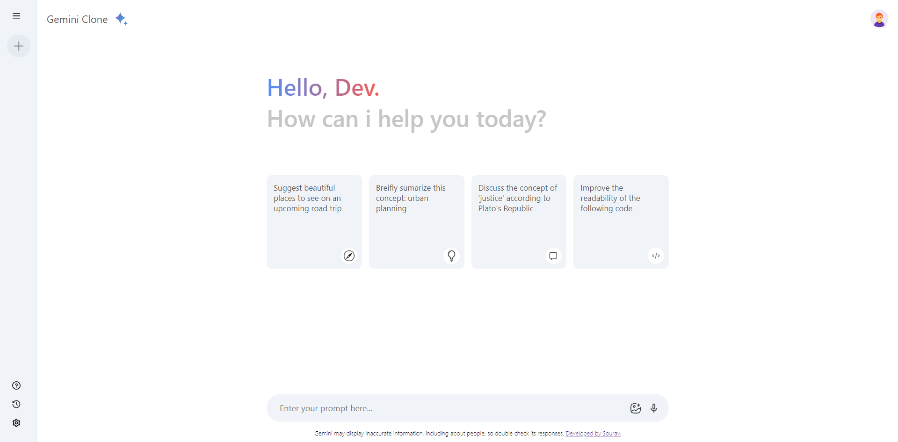

<h1 align="center" style="display:flex; align-items:center; justify-content:center; gap:10px"> Gemini Clone  </h1>
<p>
Gemini clone is a build with react js and google gemini api.

</p>



### Tech Stack and Libraries Used
- React JS


<a href="https://sourav-gemini-clone.netlify.app">Try it here ⬅️</a> 
or copy the link
```
https://sourav-gemini-clone.netlify.app/
```
<hr>


## Browsers support

| [](http://godban.github.io/browsers-support-badges/)<br/>IE / Edge | [](http://godban.github.io/browsers-support-badges/)<br/>Firefox | [](http://godban.github.io/browsers-support-badges/)<br/>Chrome | [](http://godban.github.io/browsers-support-badges/)<br/>Safari | [](http://godban.github.io/browsers-support-badges/)<br/>iOS Safari | [](http://godban.github.io/browsers-support-badges/)<br/>Opera |
| --------- | --------- | --------- | --------- | --------- | --------- |
| IE10, IE11, Edge| last 2 versions| last 2 versions| last 2 versions| last 2 versions| last 2 versions